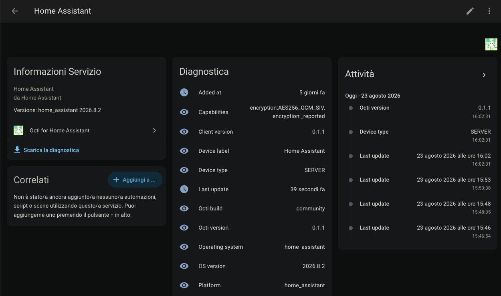

# Octi for Home Assistant

Community-maintained Home Assistant integration for [Octi](https://github.com/d4rken-org/octi), the end-to-end encrypted device synchronisation ecosystem by d4rken-org.

This project is independent from the Octi Android and web clients and is not an official Octi or Home Assistant integration.

## Status

Early beta. The integration has been exercised against a real Home Assistant Docker installation and the pinned Octi interoperability fixtures. It is not in the HACS default catalog yet.

The first milestone is a read-mostly integration that can:

- UI-based setup from an Octi linking payload;
- local decryption of the supported Octi payload encryption modes;
- read-only power, Wi-Fi, connectivity and device metadata entities;
- optional clipboard and installed-app count diagnostic entities when Octi exposes those modules; they are disabled by default because their contents can be sensitive;
- authenticated WebSocket refreshes with conditional HTTP polling as a safety net;
- one Home Assistant device per linked Octi device, with the local Home Assistant client represented as a service device;
- dynamic discovery of devices that appear after the initial setup;
- a redacted Home Assistant diagnostics endpoint for troubleshooting.

The integration does not write peer state, transfer files or synchronize encrypted blobs. It publishes only a small encrypted `MetaInfo` record describing the Home Assistant client itself. Clipboard data is sensitive; installed-app data is reduced to a count and the full inventory is not persisted in Home Assistant state.

The linked Home Assistant client advertises `Octi-Device-Platform: home_assistant` and
`MetaInfo.deviceType: SERVER`. This is the generic Octi type for server, NAS and headless
container clients. Octi clients older than `v1.1.0-rc0` may render the Meta tile for this
peer as empty and log a decode warning; the other modules continue to work.

## Installation

### HACS custom repository

The repository is public and can be installed through HACS as a custom repository. In HACS:

1. Open HACS and select the three-dot menu in the top-right corner.
2. Select **Custom repositories**.
3. Add `https://github.com/alsd4git/octi-home-assistant` as the repository URL.
4. Select **Integration** as the repository type and confirm with **Add**.
5. Find **Octi** in HACS, install it, then restart Home Assistant.

After the restart, add the integration from **Settings → Devices & services → Add integration** and search for **Octi**.

### Manual installation

For development or systems where HACS is not available, copy `custom_components/octi/` into your Home Assistant configuration directory:

```bash
mkdir -p /config/custom_components/octi
cp -a custom_components/octi/. /config/custom_components/octi/
```

Restart Home Assistant after copying the files. HACS default-catalog inclusion will be considered separately after further validation and release work; until then, the custom repository remains the recommended HACS installation path for testers.

## Configuration

1. Open **Settings → Devices & services** in Home Assistant.
2. Select **Add integration** and search for **Octi**.
3. Paste the complete linking payload generated by Octi.
4. Restart or reload the integration if you update its files manually.

The linking payload contains account credentials and encryption key material. Treat it as a secret: do not put it in issues, screenshots, shared terminals or logs.

Clipboard and installed-app entities are opt-in. When Octi exposes those modules, enable the entities individually from Home Assistant's entity registry only if you accept that their decrypted values can be visible to the UI, API, automations and recorder. The installed-app entity exposes only the count; the full inventory is not persisted in Home Assistant state.

The integration performs a periodic safety refresh every five minutes. WebSocket change events can request an earlier targeted refresh for the affected module, but event bursts are coalesced for at least 30 seconds. If Octi or the network temporarily fails, the last valid snapshot remains available instead of making every entity unavailable. HTTP 429 responses honor `Retry-After`; when the server omits it, refreshes are paused for 15 minutes before retrying. Reloading the config entry from **Settings → Devices & services** performs an immediate fresh setup.

The **Sync now** button requests an immediate refresh of all devices and modules. It does not enable clipboard/apps or perform any peer write action.

## Screenshot

This redacted Home Assistant 2026.8.2 view shows the Octi service device, diagnostic values,
the `SERVER` device type and the Octi service icon. It does not include the linked peer-device
list or account credentials.



### Removing a device

If a device is removed from the Octi account, its Home Assistant entities become unavailable. The Home Assistant device-registry entry is intentionally not deleted automatically; remove it manually from the Octi device page under **Settings → Devices & services** when you want to clean it up.

## Validation and development

The local development checks use `uv`:

```bash
uv sync
uv run ruff check .
uv run pytest -q
uv run python scripts/verify_interop_fixtures.py
```

The Home Assistant test matrix covers 2026.2.3 with Python 3.13 and 2026.8.2 with Python 3.14. The `pytest-homeassistant-custom-component` package tracks an exact Home Assistant release; intermediate 2026.x releases are expected to work from the baseline but are not individually claimed as tested. To run the newer matrix entry locally:

```bash
uv run --no-project --python 3.14 \
  --with pytest-homeassistant-custom-component==0.13.356 \
  pytest -q
```

The repository also includes GitHub Actions for Hassfest and HACS validation in [`.github/workflows/validate.yml`](.github/workflows/validate.yml).

## Documentation

- [Changelog](CHANGELOG.md)
- [Security policy](SECURITY.md)
- [Project brief](docs/01-project-brief.md)
- [Octi protocol notes](docs/02-octi-protocol.md)
- [Cryptography and interoperability](docs/03-crypto-and-interop.md)
- [Home Assistant architecture](docs/04-home-assistant-architecture.md)
- [Security and privacy](docs/05-security-and-privacy.md)
- [HACS publishing](docs/06-hacs-publishing.md)
- [MVP implementation plan](docs/07-mvp-plan.md)
- [Testing with Home Assistant Docker](docs/08-testing-on-home-assistant-docker.md)
- [Architecture decision: separate repository](docs/decisions/0001-separate-repository.md)

Protocol notes are working documentation derived from the current Octi sources, server behaviour and the maintainer discussion in [octi#370](https://github.com/d4rken-org/octi/issues/370#issuecomment-5278482391). They are not a replacement for an upstream protocol specification.

## Branding

The official Octi icon is included for the HACS/Home Assistant brand entry with permission
from the Octi maintainer ([octi#370](https://github.com/d4rken-org/octi/issues/370#issuecomment-5385059776)).
It identifies the Octi service being integrated; it is not the logo or wordmark of this
community integration, which is independent from the Octi project.

The source asset is [`icon_512.png`](https://github.com/d4rken-org/octi/blob/bc9a2264994017b41ee2ce84d61a5337a296a878/fastlane/metadata/android/en-US/images/icon_512.png);
the repository keeps the original resolution as `icon@2x.png` and a 256px `icon.png`
for Home Assistant and HACS.

## License

Original code and documentation in this repository are released under the [MIT License](LICENSE). This license does not grant permission to reuse Octi names, logos, icons, mascots or other separately protected upstream artwork.
